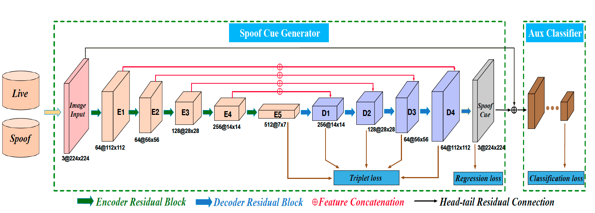
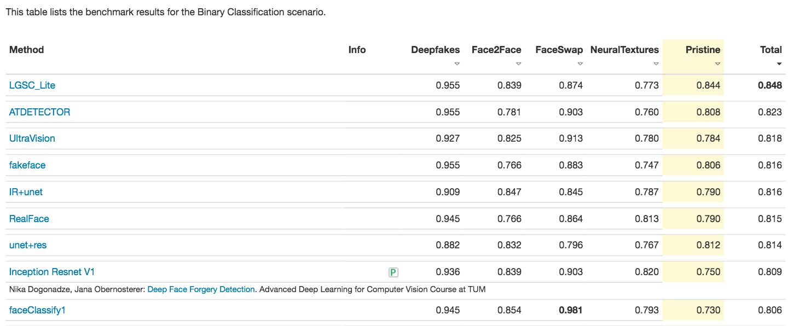

# LGSC-for-FAS

This repository contains code of ["Learning Generalized Spoof Cues for FaceAnti-spoofing (LGSC)"](https://arxiv.org/abs/2005.03922),
which reformulate face anti-spoofing (FAS) as an anomaly detection problem and learn the discriminative spoof cues via a residual-learning framework.

___

## Framework


## FaceForensics Benchmark

Based on the **LGSC**, we achieved **1st Place** on [FaceForensics benchmark](http://kaldir.vc.in.tum.de/faceforensics_benchmark/)


### Dataset and Preprocessing
We use two different compression rates: c23(medium compression) and c40(high compression) videos in [FaceForensics++](http://www.niessnerlab.org/projects/roessler2019faceforensicspp.html)
dataset as our training data. As a preprocessing step we extract crop faces frame from raw videos and totally we get 0.96 million face frames,
which contrains 0.16 million pristine frames and 0.8 million manipulated frames. Further, we balanced the proportion of positive and negative 
samples during training.

### Technology Detail
Our deep network is implemented on the platform of [PaddlePaddle(dygraph)](https://paddlepaddle.org.cn).

+ Download and preproces the dataset
```
FaceForensics/data
├── manipulated_sequences
│   └── DeepFakeDetection
│   └── Deepfakes
│   └── Face2Face
│   └── FaceSwap
│   └── NeuralTextures
├── original_sequences
│   └── actors
│   └── youtube
│       └── c23
│       └── c40
│           └── images
├── train_add_train.txt
├── train_val_train.txt
└── faceforensics_benchmark.txt
```
+ Download and convert [imagenet pretrained model](https://download.pytorch.org/models/resnet18-5c106cde.pth)
```
python convert.py

./pretrained
├── resnet18-5c106cde.pth
└── resnet18-torch.pdparams
```
+ Train
```
python train.py
```
+ Test
```
python test.py
```

## Citation
```
@inproceedings{
    feng2020deep,
    title={Learning Generalized Spoof Cues for Face Anti-spoofing},
    author={Haocheng Feng and Zhibin Hong and Haixiao Yue and Yang Chen and Keyao Wang and 
    Junyu Han and Jingtuo Liu and Errui Ding},
    year={2020},
    eprint={2005.03922},
    archivePrefix={arXiv},
    primaryClass={cs.CV}
}
```
